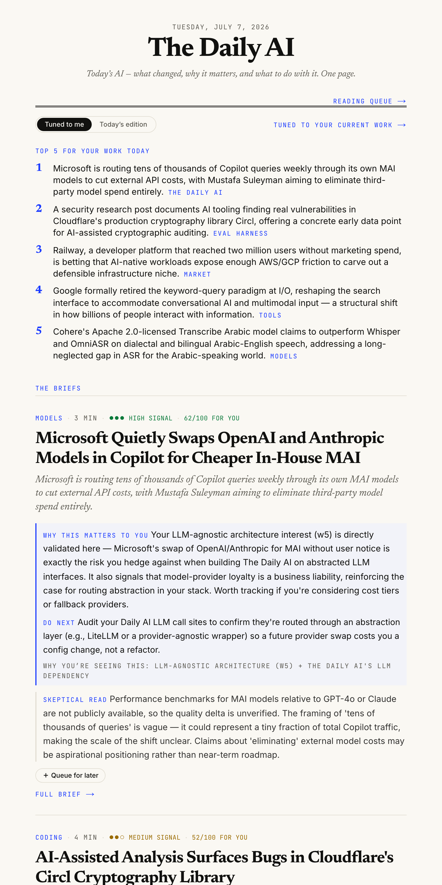
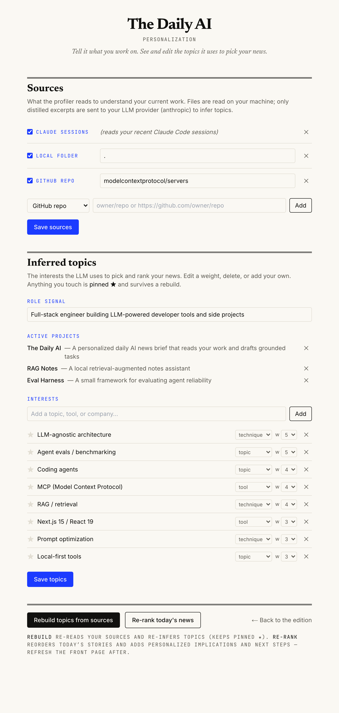
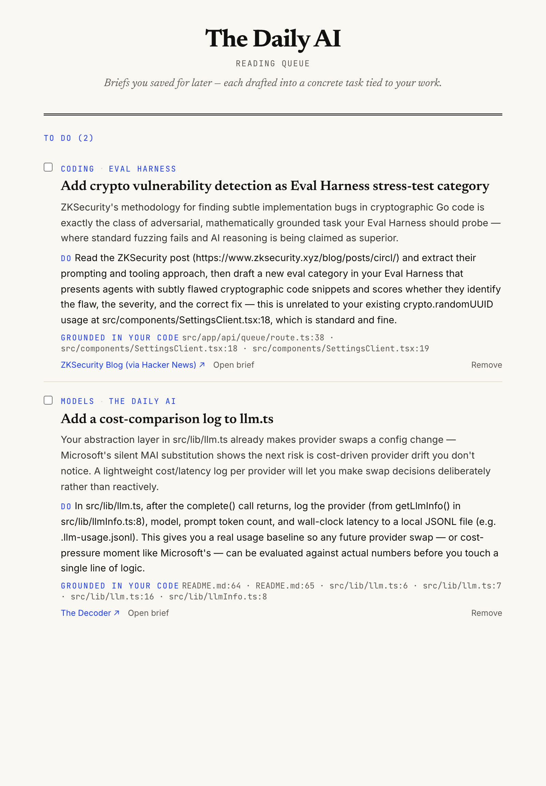
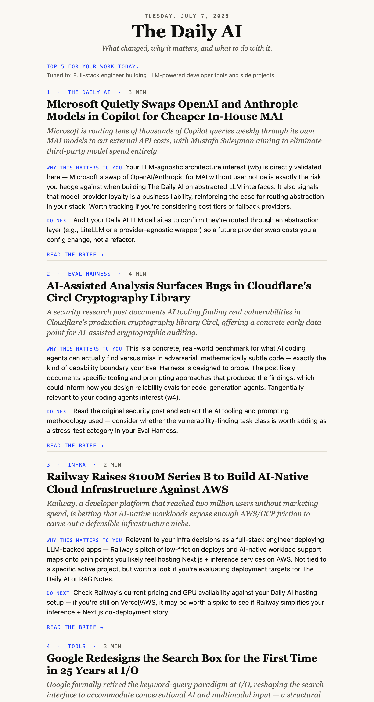

<div align="center">

# The Daily AI

**Know what changed in AI, why it matters, and what to do with it — in one page, tuned to your work.**

[](https://nextjs.org)
[](https://react.dev)
[](https://www.typescriptlang.org)
[](https://tailwindcss.com)
[](#privacy)
[](#llm-agnostic)
[](LICENSE)

</div>

Most AI news tools answer *“what happened.”* The Daily AI answers **“what changed, why it matters to
*my* work, and what to do next.”** It reads your actual context — local code repos and Claude Code
sessions — infers what you're building, then ranks and rewrites the day's AI news against it and
drafts concrete, code-grounded tasks. Everything runs **local-first** and is **LLM-provider-agnostic**.

<div align="center">



<sub>The one-page edition, re-ranked and rewritten for the reader's current work. (Screenshots use a demo profile.)</sub>

**📐 [How it works — architecture explainer (with diagrams)](https://ishtiaqhossain.github.io/the-daily-ai/)** · [read it on GitHub](docs/architecture.md)

</div>

---

## Why it's different

- **It reads your work, not just the news.** A local profiler distills your repos + Claude Code
  sessions into an interest graph — active projects, weighted topics — with evidence.
- **Every story gets a personal “Why this matters to *you*.”** Not a generic summary; an implication
  written against your project, with a **Do next** and a **“why you're seeing this”** evidence line.
- **Save → grounded task.** Queuing a brief doesn't bookmark it — an agentic `grep` over your repo
  turns it into a concrete task that **cites your real files** (`path:line`).
- **A built-in skeptic.** Every brief has a **Skeptical read** flagging what's overhyped or unverified.
- **Signal over noise.** Each story is scored on Signal · Novelty · Practical value · Hype risk.
- **Local-first & vendor-neutral.** Your context never leaves your machine as raw text; swap LLM
  providers (or run fully local via Ollama) with an env var.

---

## Screens

| Personalization settings | Reading queue (grounded tasks) |
| :--: | :--: |
|  |  |
| Manage input **sources** and view/edit/delete the **inferred topics** the LLM uses to rank your news. | Saved briefs become tasks that cite your actual code (*“Grounded in your code”*). |

<div align="center">



<sub>The same edition, delivered — the daily email, ordered to your work.</sub>

</div>

---

## How it works

```
        SOURCES                      PIPELINE (local-first, LLM-agnostic)                 SURFACES
  repos · Claude sessions   ──▶   profile ─▶ digest ─▶ personalize ─▶ email        one page · settings
  GitHub · folders · notes        (your work)  (RSS)   (rank+rewrite)  (SMTP)        · queue · inbox
```

1. **Profile** (`build-profile`) reads your enabled sources locally and distills a *current-work*
   profile (`data/profile.json`) — active projects + weighted interests. Pinned/edited topics
   survive rebuilds; deleted ones stay hidden.
2. **Digest** (`generate-digest`) pulls 5 balanced RSS feeds (Hacker News, arXiv, Hugging Face /
   Takara papers, The Decoder, VentureBeat) and an LLM writes structured, skeptical briefs.
3. **Personalize** (`personalize-edition`) scores every story 0–100 against your profile and rewrites
   the implication for you.
4. **Deliver** — read it as a one-page site, or email it (`send-digest`). A `launchd` job runs the
   whole loop each morning.

### <a id="llm-agnostic"></a>LLM-agnostic

Every model call goes through `src/lib/llm.ts` (plain `fetch`, no vendor SDK). Pick a provider with
env vars — `anthropic · openai · google · groq · together · openrouter · mistral · deepseek · ollama
· openai-compatible`. Email is likewise provider-agnostic over SMTP.

```bash
LLM_PROVIDER=ollama LLM_MODEL=llama3.1 npm run digest   # runs fully local, no cloud, no key
```

### Agentic code grounding

Rather than a vector store, the queue uses **tool-based retrieval**: the model proposes keyword
searches, `grep`/`ripgrep` runs them over your folders, and the drafted task cites the top hits.
Always fresh, no index to maintain, and secrets (`.env`, keys, lockfiles, local data) are
hard-excluded from search and reads.

### <a id="privacy"></a>Privacy

Source files are read on your machine; only distilled excerpts go to your configured LLM provider
(nothing, if it's local). Your profile, subscribers, queue, and sources live under `data/` and are
**git-ignored** — never committed.

---

## Quickstart

```bash
npm install
cp .env.example .env          # pick LLM_PROVIDER + add its key (see .env.example)

npm run dev                   # http://localhost:3000  (shows seed content out of the box)

npm run digest                # fetch today's news  → an edition
npm run tune                  # profile + personalize → tuned to your work
npm run email                 # render/send the digest (writes a preview with no SMTP set)
```

Open `/settings` to add sources (GitHub repos, local folders, Claude sessions, freeform notes) and
curate the inferred topics. Open `/queue` for saved, code-grounded tasks.

### Commands

| Command | What it does |
| --- | --- |
| `npm run dev` / `build` / `start` | Next.js dev / production build / serve |
| `npm run digest` | RSS → LLM → `generated-edition.json` |
| `npm run profile` | Read your sources → `data/profile.json` |
| `npm run personalize` | Rank + rewrite the edition for you |
| `npm run tune` | `profile` + `personalize` |
| `npm run email` | Render & send the digest (preview if no SMTP) |

### Daily schedule

`scripts/daily.sh` runs `digest → tune → email`; the `launchd` agent
(`~/Library/LaunchAgents/com.thedailyai.digest.plist`) fires it at 07:00 daily.

```bash
launchctl load -w ~/Library/LaunchAgents/com.thedailyai.digest.plist   # enable
launchctl start   com.thedailyai.digest                                # run once now
launchctl unload  ~/Library/LaunchAgents/com.thedailyai.digest.plist   # disable
```

---

## Tech stack

**Next.js 15** (App Router) · **React 19** · **TypeScript** · **Tailwind CSS** · **nodemailer** ·
**rss-parser** · any LLM over `fetch`. Content is typed data modules + JSON the pipeline generates —
no database required to run.

## Project layout

```
src/app/            # routes: / (edition), /settings, /queue, /api/*
src/components/      # Edition, SettingsClient, QueueClient, SignupForm, SignalScore
src/lib/             # llm (provider-agnostic), edition, retrieval (agentic grep),
                     #   queueDraft, emailDigest, store, types
src/content/         # seed edition (fallback) + generated JSON (git-ignored)
scripts/             # generate-digest, build-profile, personalize-edition, send-digest, daily.sh
```

## License

[MIT](LICENSE) © 2026 Ishtiaq Hossain

<div align="center"><sub>Built with a lot of help from an AI pair — of course.</sub></div>
