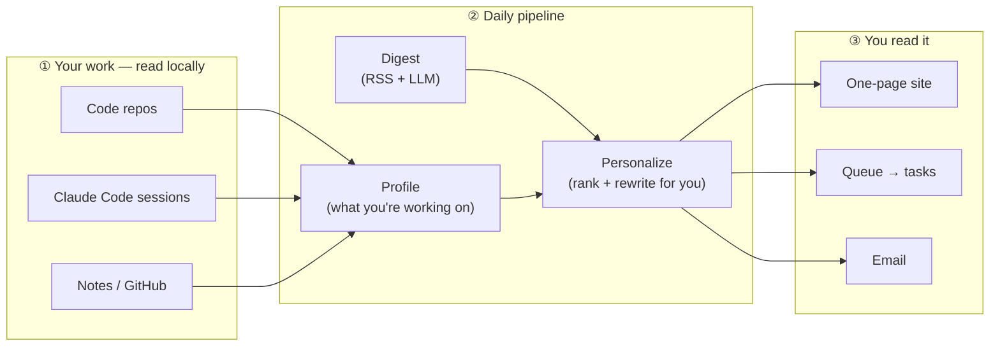
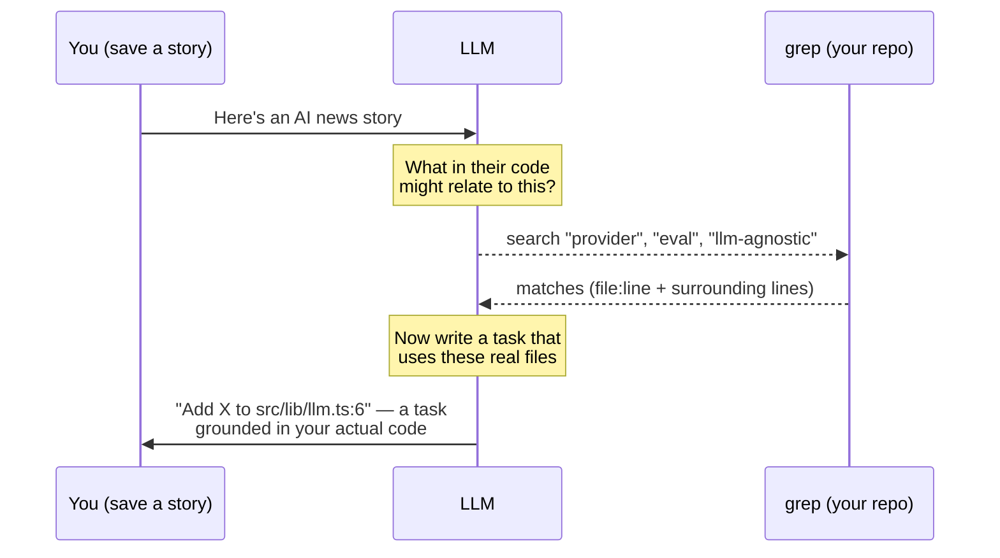
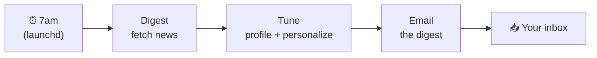
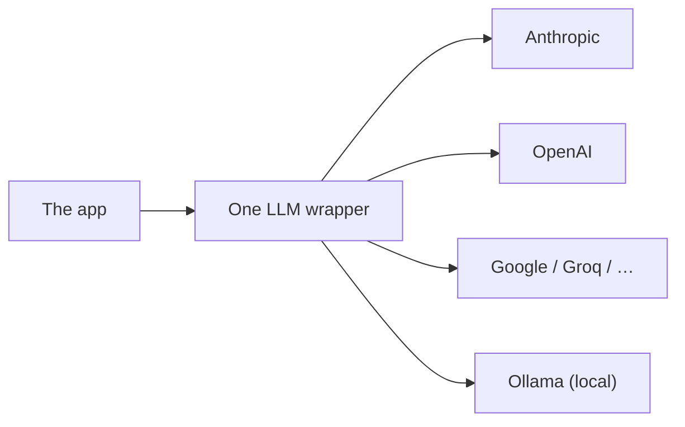

# How The Daily AI works

A plain-English tour of the architecture — how it reads your work, why there's **no search index**, and how the little "agent loop" turns a news story into a task that points at your own code.

> **One line:** it reads what you're building, fetches the day's AI news, and rewrites that news *for you* — all on your own machine.

---

## 1. The big picture

Three stages: it learns **your work**, it fetches **the news**, and it gives you **something useful**.

Everything in the middle runs locally and works with **any LLM** (cloud or a local model).

---

## 2. How your information is consumed

The app builds a small **profile** of what you're currently working on. It reads a few local sources — you choose which:

| Source | What it reads |
| --- | --- |
| **Code folders** | project name, dependencies, README, file list (not your full source code) |
| **Claude Code sessions** | only *your* typed prompts from recent sessions (not the AI's replies or tool output) |
| **GitHub repo** | the public description, topics, and README |
| **A note** | free text you write about what you're doing |

An LLM then **distills** all of that into a short list — *active projects* and *weighted interests* — with a note of where each came from. That distilled list is all that's kept; the raw files are never stored or shipped anywhere as-is.

You can see and **edit** this list (add, delete, re-weight, pin) on the settings page.

---

## 3. Is there a search index / "RAG"? — No, on purpose

A common approach is **RAG**: pre-scan everything into a special "vector" database, then search it. The Daily AI deliberately **doesn't** do that. Here's why:

- **The news is tiny.** Only ~5–12 stories a day — they fit in one LLM prompt. An index would add complexity for zero benefit, and the LLM reasons about relevance far better than a similarity score.
- **Your code changes constantly.** A pre-built index goes stale the moment you write code. So instead of indexing your repo, the app **searches it fresh, on demand** — like you hitting "find in files."

That "search fresh, on demand" is the interesting part 👇

---

## 4. The agentic loop (how a saved story becomes a task about *your* code)

When you hit **＋ Queue** on a story, the app doesn't just bookmark it. It runs a tiny **think → look → use** loop:

The model **decides what to search for**, a plain text search runs it over your folders, and the result gets folded into the task it writes. That's what "agentic" means here: the AI takes an action (search) with a tool (grep) and uses what it finds — no vector database required, and it's always up to date.

**Safety:** the search flatly refuses to open secrets (`.env`, keys), lockfiles, or your saved data — so it can see your code but never your credentials.

---

## 5. The daily loop (it comes to you)

A scheduled job runs the whole thing each morning so you don't have to:

Read it as a one-page site, or let it land in your inbox — ordered to your work, with a "why this matters to *you*" and a next step per story.

---

## 6. Two design choices worth calling out

**LLM-agnostic.** Every model call goes through one small wrapper. Switching from Anthropic to OpenAI, Google, Groq, or a **fully local** model (Ollama) is a one-line environment change — no code edits. Nothing is locked to a single vendor.

**Local-first & private.** Your files are read on your machine. Only short, distilled excerpts are sent to your chosen LLM for the thinking steps — and if that LLM is a local one, *nothing leaves your computer*. Your profile, saved tasks, and email list live in a local folder that's never committed.

---

## In short

- It **reads your work** (a few local sources) and distills it into a small, editable profile.
- It **fetches the day's AI news** and rewrites it *for you*.
- There's **no search index** — instead, saving a story triggers a small **agent loop** that greps your repo live and writes a task citing your real files.
- A **morning job** delivers it all, and you can swap the underlying AI (or keep it fully local) with one setting.

← Back to the [project README](https://github.com/Ishtiaqhossain/the-daily-ai#readme) · [browse the code](https://github.com/Ishtiaqhossain/the-daily-ai)
